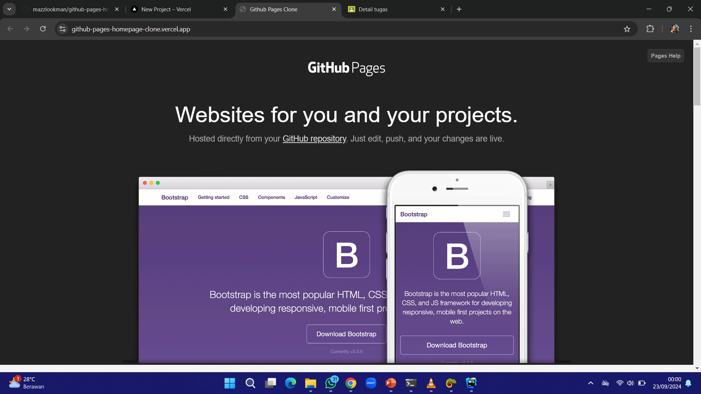
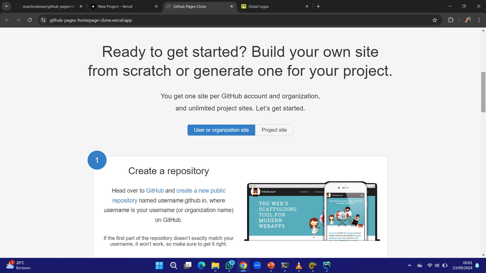
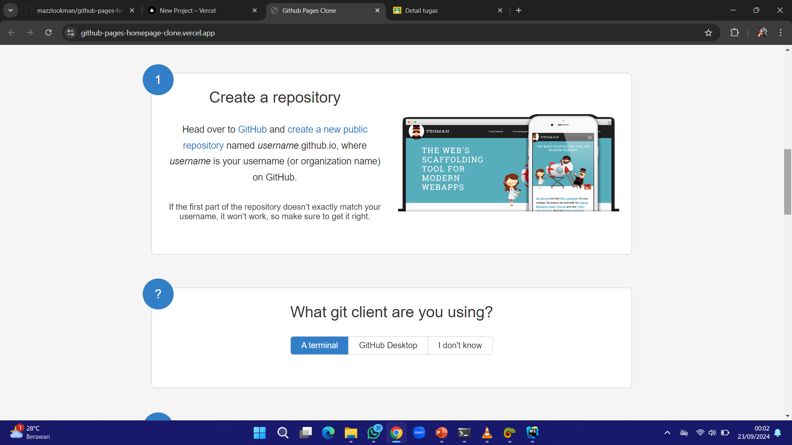
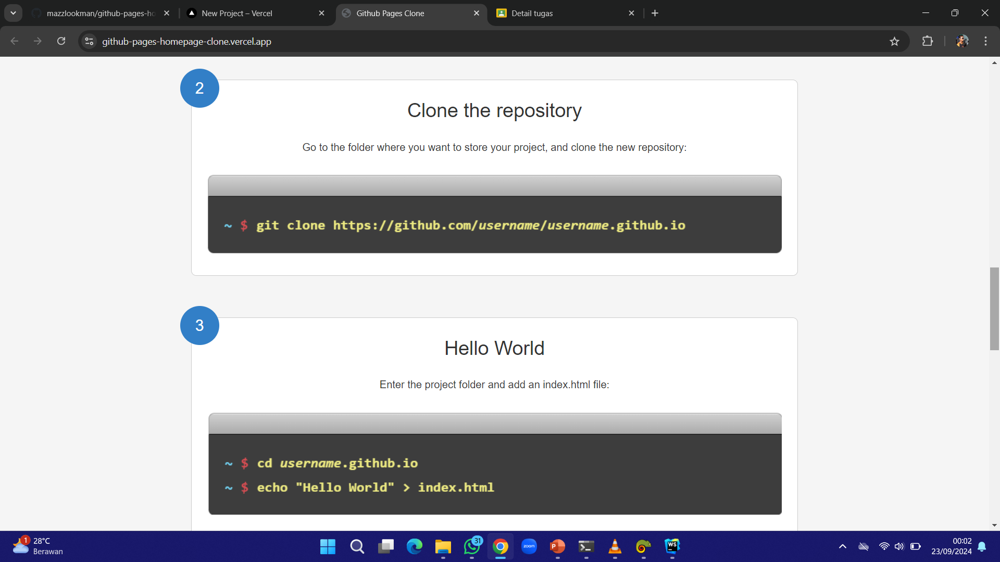
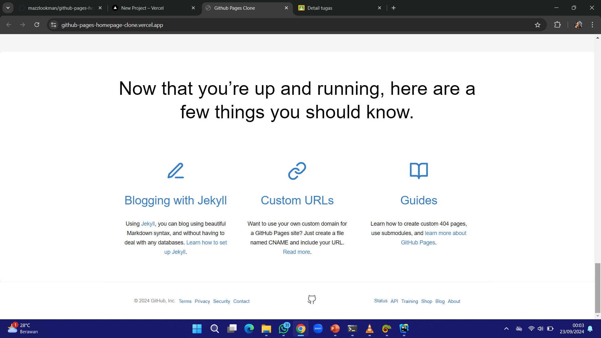

# [Task 1] - HTML & CSS
Fullstack Productzilla Academy #MSIB7

## Github Pages Homepage Cloning
Already responsive for greater than equal to "small" screen sizes `>=576px`.

<u>[Click here for Demo](https://github-pages-homepage-clone.vercel.app/)</u>

## Sections:
#### Header:

#### Main section:

#### Footer:
